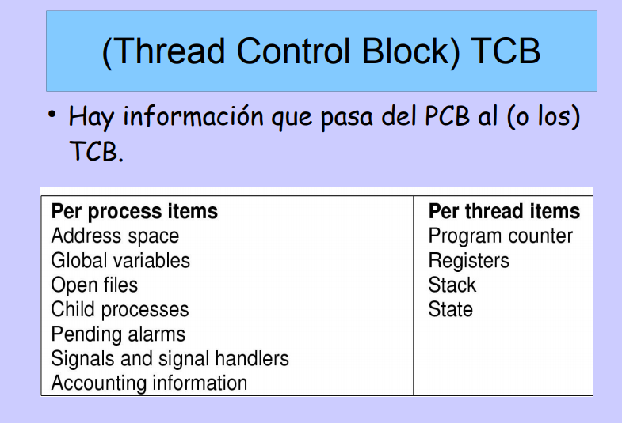

#### Threads.

##### Hilos de ejecución (Execution Threads).
* Se separa la ejecución del agrupamiento de recursos.
* Los procesos agrupan los recursos usados.
* Los Threads son hilos de ejecución que comparten el agrupamiento de recursos.
    * Puede implementarse por multiprogramacion o multiprocesamiento.

* Lo threads comparten procesos, entre ellos memoria. Un mismo proceso se puede ejecutar en distintos threads.
* Cada Thread mantiene su propia información del estado (control block etc).
* Entra una nueva estructura, el Thread Control Block (TCB)
 