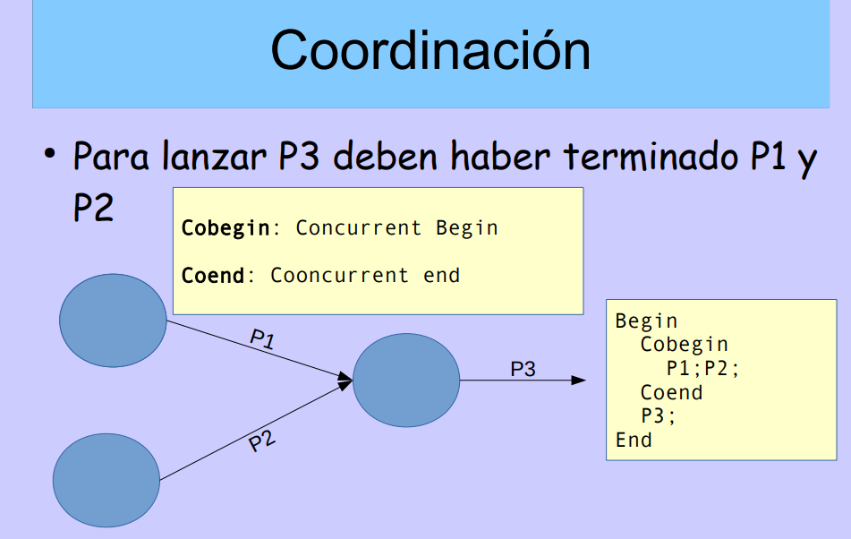
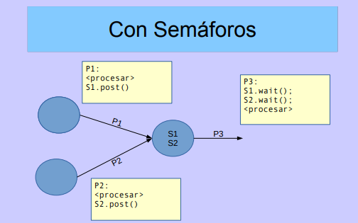

##### Aca arrancan las clases de Clua.

##### Semaforos : 
[diapos](https://campus.fi.uba.ar/pluginfile.php/271389/mod_resource/content/3/11-Semaforos.pdf)

Los problemas en el parcial tienen que ver exclusivamente con sincronizacion.

- > Habla un poco de memorias compartidas y semáforos.
- > En un momento dice que debemos compilar con el estándar de cpp 2017.
- > La programación concurrente no es facil. (Eso dice mr Clua).

Finalmente nombra la definición de semáforos.

- Son variables protegidas usadas para controlar los problemas de concurrencia. (todo esto se lo debemos a dijkstra)
- Tienen operación de prueba y espera. (P() wait() o down ())
- y una de liberación. (v() post() up() )

Existen varias versiones, SystemV, Posix , Mutex.

- > Por ahora antes del parcial nos vamos a entrar en wait() y post() .

lo que hizo Osvaldo fue encapsular todos la dificultad de semaforos en 2 clases de c++ que estan implementadas en el campus. o no ?

Estas clases tienen 2 métodos, wait y post.

Haciendo un mea culpa, la parte que se puso a codear no entendí una papa.

##### Después arranca con los problemas tipo parcial.
 - Cobegin, todo lo que sigue puede ejecutarse en conjunto.
 - Coend, termina la forma concurrente y vuelve a lo presencial.  

 se podria decir que le cambia el significado al punto y coma, en el medio se puede pensar como paralelismo mas que instrucciones separadas.

 

 

 y escritos con semáforos quedaría :

 

En el parcial (segun entendi) tenemos que hacer solamente los dibujitos basados en el Cobegin Coend que nos da Clua.

