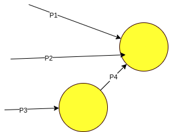
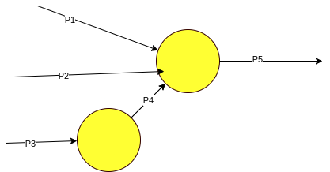
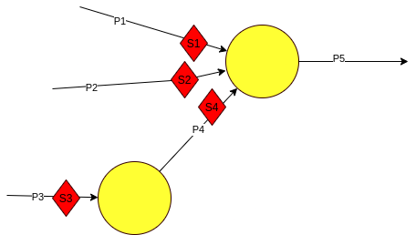
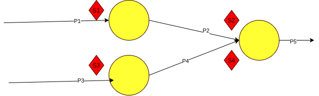
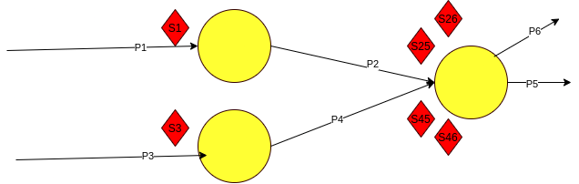

### Esta clase vamos a hacer ejercicios tipo parcial : 


A partir del codigo : 
```
cobegin
    P1;p2
    begin 
        P3:P4:
    end;
coend
```

El diagrama quedaría asi : 



<br>
Ahora Osvaldo metió una variación a este ejercicio : 

```
begin
    cobegin
        P1;p2
        begin 
            P3:P4:
        end;
    coend
    P5
end
```
Por lo tanto el diagrama nos quedaria, 


y deberíamos solucionarlo metiendo semáforos. 

.

y ahora hacemos el código :

```cpp
S1.init(0)
S2.init(0)
S3.init(0)
S4.init(0)

P1: 
    <ejecutar>
    S1.post()
P2: 
    <ejecutar>
    S2.post()
P3:
    <ejecutar>
    S3.post()
P4:
    S3.wait()
    <ejecutar>    
    S4.post()
P5:
    S1.wait()
    S2.wait()
    S4.wait()
    <ejecutar>
```
con esto ya re contra queda la idea.
Creo que post lo que hace es liberar el thread.

Después del ejemplo mister Clua lo lleva a código.
<br>

Ahora mete otro ejemplo : 

```
begin
    cobegin
        begin P1;P2 end
        begin P3;P4 end
    coend
    P5
end
```
Armamos el diagrama : 


```cpp
S1.init(0)
S2.init(0)
S3.init(0)
S4.init(0)

P1: 
    <ejecutar>
    S1.post()
P2:
    S1.wait()
    <ejecutar>
    S2.post()
P3: 
    <ejecutar>
    S3.post()
P4:
    S3.wait()
    <ejecutar>
    S4.post()
P5:
    S2.wait()
    S4.wait()
    <ejecutar>
```

No es tan preocupante el tema parece ...

Ahora Osvaldo mete una variante, donde saliendo del ultimo circulito metemos un P6 también. No entiendo porque esto genera que tengamos que tener mas semáforos : 



entonces el codigo nos quedaria : 


```cpp
S1.init(0)
S25.init(0)
S26.init(0)
S3.init(0)
S45.init(0)
S46.init(0)

P1: 
    <ejecutar>
    S1.post()
P2:
    S1.wait()
    <ejecutar>
    S25.post()
    S26.post()
P3: 
    <ejecutar>
    S3.post()
P4:
    S3.wait()
    <ejecutar>
    S45.post()
    S46.post()
P5:
    S25.wait()
    S45.wait()
    <ejecutar>
P6:
    S26.wait()
    S46.wait()
    <ejecutar>
```
La razón por la cual hay que meter un semáforo mas la desconozco.

