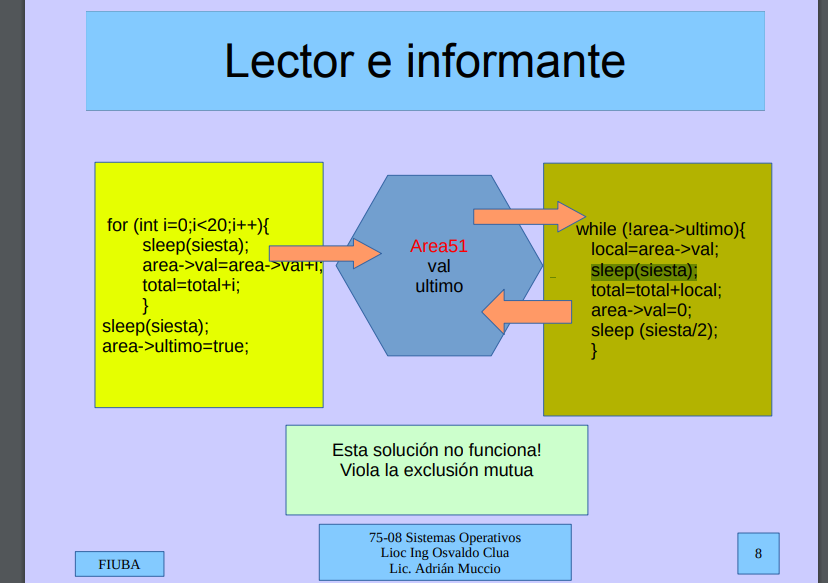
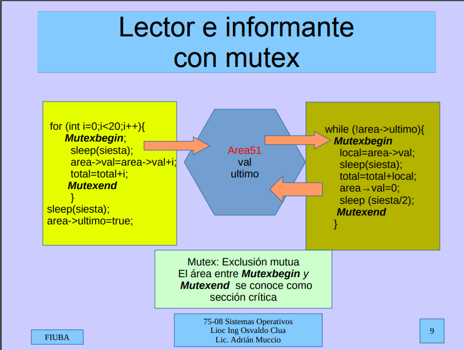

### Memoria compartida (Diapo de memoria compartida)Esta [aca](http://materias.fi.uba.ar/7508/Slides/10-SharedMem.pdf)

* Es memoria que puede ser accedida simultáneamente por varios procesos.
* Unix tiene varios tipos de memoria compartida. Los mas conocidos son **System V** y **Posix**.
* Se usara una clase p_shm (Posix Shared Memory) o sv_shm (System V ..).

#### Estas clases nos ofrecen los siguientes métodos públicos. 

##### Constructores.
* `sv_shm("clave/")`
* `p_shm("clave/")`

Obtiene un area de memoria compartida asociada a la clave.
(si no se pasa ninguna, la clave es "default/")

##### Mapear la dirección.

* `void * map (size)` devuelve la dirección donde mapear la memoria compartida.

##### Liberar recursos
* `void del()` : libera la memoria compartida.

Se tiene el siguiente header de memoria compartida Posix :

```cpp
class p_shm {
    string clave;
    int shm;
public:
    p_shm(string cla="/default");
    void del();
    int getShm(){return shm;}
    void * map(int size=BUFSIZE);
    string getClave(){return clave;}
    friend ostream& operator <<(ostream& os, p_shm shm);
};
```

Y para System V : 

```cpp
class sv_shm{
    string clave;
    int shm;
    key_t ktclave;
public:
    sv_shm(string cla="/default");
    void del();
    int getShm(){return shm;}
    key_t getKtClave(){return ktclave;}
    void * map(int size=BUFSIZE); // size esta por compatibilidad con las posix. Se usa BUFSIZE
    string getClave(){return clave;}
    friend ostream& operator <<(ostream& os, p_shm shm);
};
```

#### Ejemplo de sistema  lector-informante  : 

* Un proceso lee un sensor y acumula su valor en un area compartida.
* Otro proceso toma el acumulado y lo reporta, volviendo a poner en cero el acumulador.

 El area compartida 

```cpp
typedef struct {
    bool ultimo=false;  
    int val=0;
}dat;
```

##### Declaramos el semáforo : 

```cpp
    p_shm Area51("Area51"); //sv_shm Area51(“Area51”)
    void* ptr;
    dat* area;
    int len=sizeof(dat);
    ptr=Area51.map(len); //reservamos memoria.
    area=reinterpret_cast<dat *> (ptr); //ver documentación, es estándar de cpp. 
    area->val=100;//escribo en memoria.
```

y luego si en otro proceso quiere leer simplemente tiene que hacer hacer :

```cpp
    sv_shm Area51("Area51");
    void* ptr;
    dat* area;
    int len=sizeof(dat);
    ptr=Area51.map(len);
    area=reinterpret_cast<dat *> (ptr); 
    std::cout<<"val es" : << area->val <<std::endl;
```

Ahora si pensamos un problema del tipo lector informante, podemos tener un problema de exclusión mutua.



Esto lo tenemos que solucionar con Mutex.



Esto es trivial, lo básico en concurrencia.

Vamos a utilizar las palabras claves MutexBegin and MutexEnd como para delimitar las zona clave de exclusión mutua.

Obvio que el problema solo esta en los writes, al hacer read no hay ningún problema de concurrencia.
Ahi aparecen los semaforos.


*En clase dio una breve idea de como solucionarlo con código común, pero dice que este cuatri no lo van a dictar a ese tema.*

Vamos a usar [semaforos](http://materias.fi.uba.ar/7508/Slides/11EL-ExcMutua-Estructuras.pdf) del sistema operativo, pero con un wrapper hecho por la cátedra.

Vamos a usar dos primitivas principales, 
1. `mutex.wait()` para entrar en la sección critica.
2. `mutex.post()` para salir de la sección critica.


Y con esto podemos tener exclusión mutua sobre la clave que nos interese. (o asociar los semaforos a una clave para diferenciar las distintas zonas de exclusión, y dicha clave es la que recibe por el constructor).


Entonces el problema de lector/informante nos queda como  : 

El informante : 

```cpp
#include <iostream>
#include "dat.h"
#include "sv_shm.h"
#include "sv_sem.h"

int main (int argc, char *argv[]) {
    sv_shm mem51("Area51");
    sv_sem sem51("Mutex51");
    unsigned int siesta = 2;
    void* ptr;
    dat* area;
    int len = sizeof(dat);
    area = reinterpret_cast<dat*>(ptr);
    for (int i=0;i<20;i++) {
        sem51.wait();
        sleep(siesta);
        area->val=area->val+i;
        total=total+i;
        sem51.post()
    }
}
    sleep(siesta);
    area->ultimo=true;
```

y del lado del lector :

```cpp
#include <iostream>
#include "dat.h"
#include "sv_shm.h"
#include "sv_sem.h"

int main (int argc, char *argv[]) {
    sv_shm mem51("Area51");
    sv_sem sem51("Mutex51",1); //le damos valor inicial (Verificar el segundo parametro).
    unsigned int siesta = 2;
    void* ptr;
    dat* area;
    int len = sizeof(dat);
    area = reinterpret_cast<dat*>(ptr);
    while(!area->ultimo)
        sem51.wait();
        sleep(siesta);
        area->val=area->val+i;
        printf("%i",area->val);
        sem51.post()
    }
    printf("Ya imprimimos todo");
    mem51.del();
    sem51.del();
}
```

Ojo al tejo, la liberación de recursos la tenemos que hacer en un proceso solo.
 Por eso normalmente hasta se tiene en otro proceso aparte que se corre cuando terminaron los dos.

