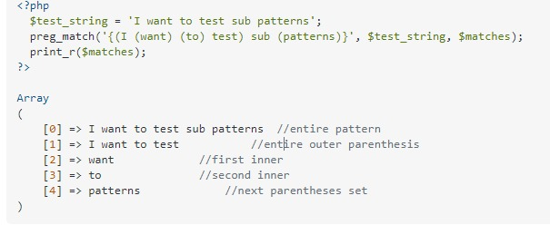

##### Ejercicios que quedaron sin hacer :
* El ejercicio 6 esta medio precario.
* El 8 esta sin hacer.
* El 10b esta turbio.
* Rangos de números? como el de canciones.

Dejo aca un [tutorial  ***fachero facherito***](https://www.geeksforgeeks.org/sed-command-in-linux-unix-with-examples/)
#### Notas que saco de hacer la guia de ejercicios ***carita fachera facherita*** :
* El comando -g (Al final) hace que la sustitucion se aplique sobre todas las apariciones del patron.
* Con \\(\\) podemos generar grupos, y luego referenciarlos con \\1, \\2 etc...
* Haciendo -n lo corremos en quiet, pero agregando el parametro p al final imprimimos las lineas que editamos con la sustitución de sed.
* Parece que para que ande el + lo debemos proteger con backslash.
* Si queremos agregar algo al final podemos sustituir con $.
* Aca el or adentro de conjuntos se hace con [].
* Como referenciar nested groups 

 

